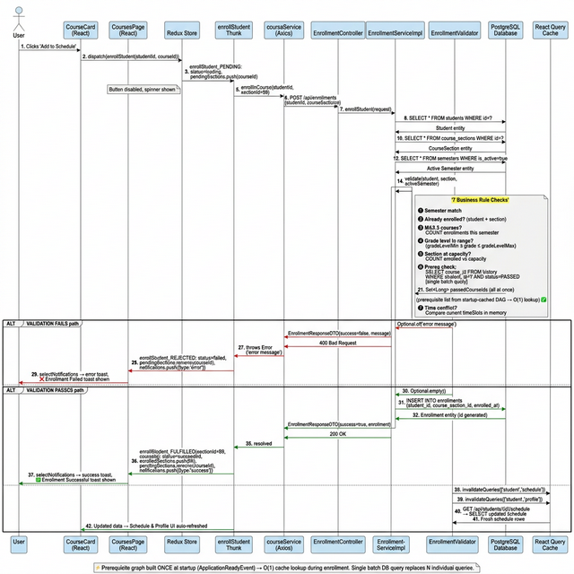

# Maplewood High School - Student Management System

A full-stack web application for managing student enrollment, course scheduling, and academic progress tracking.

## Overview

This system provides course enrollment management and academic tracking for high school students (grades 9-12), featuring real-time validation, GPA calculation, and schedule conflict detection.

## Technology Stack

**Backend**
- Spring Boot 4.0.3 (Java 25)
- PostgreSQL 17 with Hibernate ORM (JPA)
- Spring Security 7.x (HTTP Basic Auth + BCrypt)
- Spring Validation (Jakarta Bean Validation)
- MapStruct (Entity ↔ DTO mapping)
- Lombok (Boilerplate reduction)
- JSpecify (Null-safety annotations)
- Maven

**Frontend**
- React 19 with TypeScript
- Vite 7 (Modern build pipeline)
- Tailwind CSS
- Redux Toolkit + redux-persist
- TanStack Query (React Query)
- DOMPurify (XSS sanitization)

**Infrastructure & DevOps**
- Docker & Docker Compose
- GitHub Actions (CI/CD)
- Terraform (AWS EC2 provisioning)
- Ansible (server configuration & deployment)
- GHCR (GitHub Container Registry)

## Prerequisites

- Docker & Docker Compose
- Node.js 20+ (for local frontend development only)

## Getting Started

### 1. Configure Environment Variables

```bash
cp .env.example .env
```

The default values are pre-configured for local Docker development.

### 2. Run with Docker (Recommended)

```bash
make build
make up
```

> **Note**: On first startup, the `DataInitializer` automatically seeds the PostgreSQL database with realistic sample data (students, courses, teachers, schedules). No manual setup required.

- Frontend: `http://localhost:3000`
- Backend API: `http://localhost:8080`

### Alternative: Run Locally

**Backend:**
```bash
cd backend
./mvnw spring-boot:run
```

**Frontend:**
```bash
cd frontend
npm install
npm run dev
```

## Testing

```bash
# Backend unit tests
make test-backend   # or: cd backend && mvn test

# Frontend unit tests
make test-frontend  # or: cd frontend && npm test
```

CI runs automatically on every push and pull request via GitHub Actions.

## Authentication

Credentials are loaded from `.env`. Default values:

| Role    | Username  | Password   |
|---------|-----------|------------|
| ADMIN   | `admin`   | `admin`    |
| STUDENT | `student` | `password` |

## API Documentation

See [`backend/README.md`](backend/README.md) for a detailed API testing guide.

**Quick Test:**
```bash
curl -u admin:admin http://localhost:8080/api/students/101 | jq
```

## Project Structure

```
cotton-candy-cat/
├── .github/workflows/
│   ├── ci.yml              # Tests on every push/PR
│   └── deploy.yml          # Manual deploy to AWS EC2
├── backend/                # Spring Boot API
│   └── src/main/java/com/maplewood/
│       ├── config/         # Security, DataInitializer, PrerequisiteGraphInitializer
│       ├── controller/     # REST controllers
│       ├── service/        # Business logic + EnrollmentValidator
│       ├── repository/     # Spring Data JPA repos
│       ├── model/          # JPA entities
│       ├── dto/            # API contracts
│       ├── mapper/         # MapStruct mappers
│       └── util/           # PrerequisiteGraph (DAG)
├── frontend/               # React App (Vite + TypeScript)
│   └── src/
├── infrastructure/
│   ├── terraform/          # AWS EC2 provisioning
│   └── ansible/            # Server configuration & deployment
├── docker-compose.yml
├── Makefile
├── enrollment-sequence-diagram.png  # Enrollment flow diagram
└── ARCHITECTURE_DECISIONS.md
```

## Architecture & Modernization

See [**ARCHITECTURE_DECISIONS.md**](./ARCHITECTURE_DECISIONS.md) for details on:
- Vite 7 migration & React 19 Compiler
- DAG-based prerequisite management
- Security hardening (CSP, HSTS, XSS protection)
- Transaction management & clean service architecture
- Planned enhancements (Auth0, Snyk/OWASP dependency scanning)

### Enrollment Request Flow

> End-to-end flow from a student clicking "Enroll" through the Redux thunk, REST API, business validation, database write, and back to the UI.




## Best Practices

- **Startup-Cached DAG**: Prerequisite graph is built once at startup via `ApplicationReadyEvent`, then queried in O(1) during every enrollment
- **Batch DB Queries**: Student history is fetched in a single query and verified in-memory using `Set<Long>` lookups
- **JSpecify Null Safety**: Uses `org.jspecify.annotations.NonNull` (Spring 7.0 standard) instead of deprecated Spring annotations
- **Auto Data Seeding**: `DataInitializer` seeds the PostgreSQL database on first boot — no manual setup needed
- **React Compiler**: Automatic memoization via React 19 Compiler (no manual `useMemo`/`useCallback`)
- **Input Sanitization**: DOMPurify (frontend XSS prevention) + Jakarta Validation (`@Valid`) on all DTOs
- **Transaction Management**: All write operations use `@Transactional` for ACID guarantees
- **Error Handling**: Centralized `@ControllerAdvice` with standardized JSON error responses
- **Security**: Role-based access control, hardened headers, strict CORS
- **Testing**: Backend (JUnit) + Frontend (Vitest) run on every CI push

## License

Created for educational purposes.
